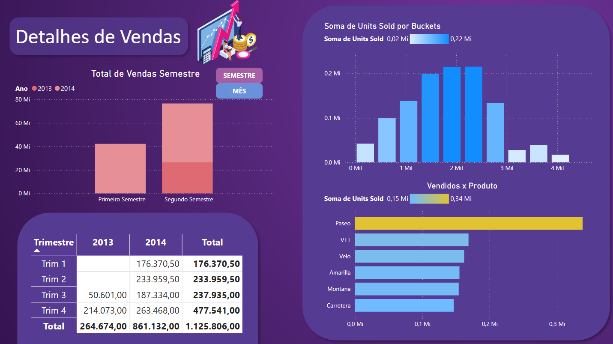
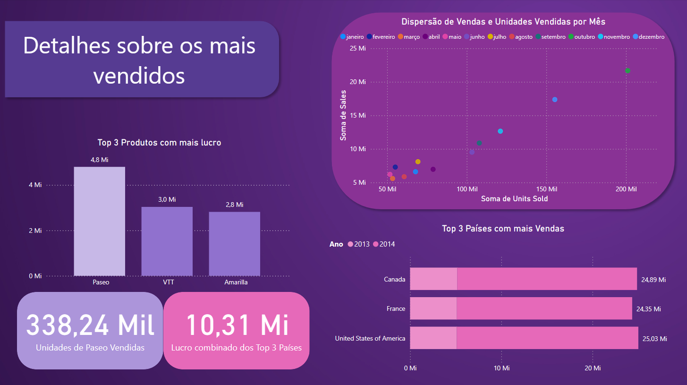

# Desafio DIO
## Projeto de Data Analytics com Power BI

Criamos três páginas de relatório conforme as instruções do desafio.

Página 1:

Página 2:

Página 1:

Para fazer o TOP N, usamos a função de Filtro do PBI.

Estabelecemos clusterização em Units Sold (20 segmentos), e agrupamos os diversos segmentos em Segments para colocar em perspectiva a diferença do segment Governo para com os demais.
